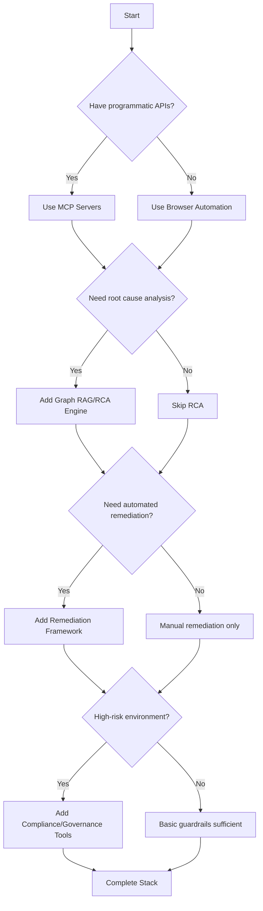

# Getting Started with Autonomous Operations

A practical guide to building your first AI-powered autonomous operations system.

## Table of Contents

- [What is Autonomous Operations?](#what-is-autonomous-operations)
- [Prerequisites](#prerequisites)
- [Decision Framework](#decision-framework)
- [Minimum Viable Stack](#minimum-viable-stack)
- [30-Minute Quickstart](#30-minute-quickstart)
- [Common Pitfalls](#common-pitfalls)
- [Next Steps](#next-steps)

## What is Autonomous Operations?

Autonomous operations combines AI, observability, and reliability engineering to create systems that can:

- **Diagnose incidents** using graph-based reasoning over logs, metrics, and traces
- **Execute remediation** autonomously with proper safety guardrails
- **Navigate ops consoles** and interact with tools that lack APIs
- **Coordinate across toolchains** (Kubernetes, Jira, Splunk, PagerDuty, etc.)

It's not about replacing humans — it's about augmenting ops teams with intelligent assistants that handle routine tasks and accelerate incident response.

## Prerequisites

### Technical Knowledge

- **Basic SRE/DevOps**: Understanding of observability, incident management, and on-call workflows
- **API Integration**: Familiarity with REST APIs and authentication
- **Infrastructure**: Experience with containerization (Docker) and orchestration (Kubernetes)
- **Programming**: Python or JavaScript for automation scripting

### Infrastructure Requirements

**Minimum:**
- Observability platform (Prometheus, Grafana, Splunk, Datadog, or similar)
- Ticketing system (Jira, ServiceNow, GitHub Issues, or similar)
- Kubernetes cluster (or equivalent orchestration platform)
- LLM access (OpenAI API, Anthropic Claude, or self-hosted)

**Recommended:**
- Centralized logging (ELK, Loki, or similar)
- Distributed tracing (Jaeger, Tempo, or similar)
- Alert management (PagerDuty, Opsgenie, or similar)

## Decision Framework

### Do You Need Autonomous Ops?

Ask yourself these questions:

1. **Volume**: Do you have >50 alerts/incidents per week?
2. **Toil**: Do engineers spend >30% time on repetitive ops tasks?
3. **MTTR**: Is your Mean Time To Resolve >30 minutes for routine incidents?
4. **Complexity**: Do incidents require correlation across multiple systems?
5. **Scale**: Are you managing >100 services or microservices?

**If you answered "yes" to 3+ questions**, autonomous ops can provide significant value.

### Which Components Do You Need?



## Minimum Viable Stack

For a **proof-of-concept autonomous ops system**, you need:

### 1. Diagnostic Layer (Choose One)

**Option A: Semantic Search Over Logs** (Simplest)
- **Tool**: [txtai](https://github.com/neuml/txtai)
- **Why**: Easy to set up, works with existing logs
- **Effort**: 1-2 days

**Option B: Graph-Based RCA** (More Powerful)
- **Tool**: [LangGraph](https://github.com/langchain-ai/langgraph) + custom logic
- **Why**: Better for complex multi-signal correlation
- **Effort**: 1-2 weeks

### 2. Tool Access Layer

**Option A: MCP Servers** (If APIs exist)
- **Tools**:
  - [GitHub MCP Server](https://github.com/github/github-mcp-server)
  - [MCP Kubernetes](https://github.com/kubernetes/kubernetes) (custom implementation)
- **Why**: Secure, structured access to operational tools
- **Effort**: 2-4 days per integration

**Option B: Browser Automation** (For console-only tools)
- **Tool**: [Playwright](https://github.com/microsoft/playwright)
- **Why**: Can interact with any web UI
- **Effort**: 3-5 days

### 3. Safety & Governance Layer

**Minimum:**
- Human-in-the-loop approval for write operations
- Audit logging of all agent actions
- Rate limiting and circuit breakers

**Tools**:
- [Open Policy Agent](https://github.com/open-policy-agent/opa) for policy enforcement
- [NeMo Guardrails](https://github.com/NVIDIA/NeMo-Guardrails) for LLM constraints

**Effort**: 2-3 days

## 30-Minute Quickstart

Let's build a simple autonomous incident investigator that can query Prometheus and create GitHub issues.

### Step 1: Set Up MCP Prometheus Server (10 minutes)

```bash
# Clone the MCP servers repository
git clone https://github.com/modelcontextprotocol/servers.git
cd servers/src/prometheus

# Install dependencies
npm install

# Configure Prometheus endpoint
export PROMETHEUS_URL=http://your-prometheus:9090

# Run the server
npm start
```

### Step 2: Set Up MCP GitHub Server (5 minutes)

```bash
cd ../github

# Install dependencies
npm install

# Configure GitHub token
export GITHUB_TOKEN=your_github_token

# Run the server
npm start
```

### Step 3: Create Simple Investigation Agent (15 minutes)

```python
# incident_investigator.py
import anthropic
import json
import requests

class IncidentInvestigator:
    def __init__(self, anthropic_api_key, prometheus_url, github_token):
        self.client = anthropic.Anthropic(api_key=anthropic_api_key)
        self.prometheus_url = prometheus_url
        self.github_token = github_token

    def query_prometheus(self, query):
        """Query Prometheus for metrics."""
        response = requests.get(
            f"{self.prometheus_url}/api/v1/query",
            params={"query": query}
        )
        return response.json()

    def investigate_alert(self, alert_name, service_name):
        """Investigate an alert using AI."""

        # Define tools for Claude
        tools = [
            {
                "name": "query_metrics",
                "description": "Query Prometheus metrics for diagnostic information",
                "input_schema": {
                    "type": "object",
                    "properties": {
                        "query": {"type": "string", "description": "PromQL query"}
                    },
                    "required": ["query"]
                }
            }
        ]

        # Initial investigation prompt
        messages = [
            {
                "role": "user",
                "content": f"Investigate alert '{alert_name}' for service '{service_name}'. Check CPU, memory, error rates, and latency."
            }
        ]

        # Agentic loop
        while True:
            response = self.client.messages.create(
                model="claude-3-5-sonnet-20241022",
                max_tokens=4096,
                tools=tools,
                messages=messages
            )

            # Check if Claude wants to use a tool
            if response.stop_reason == "tool_use":
                tool_use = next(block for block in response.content if block.type == "tool_use")

                if tool_use.name == "query_metrics":
                    # Execute Prometheus query
                    result = self.query_prometheus(tool_use.input["query"])

                    # Add tool result to conversation
                    messages.append({"role": "assistant", "content": response.content})
                    messages.append({
                        "role": "user",
                        "content": [
                            {
                                "type": "tool_result",
                                "tool_use_id": tool_use.id,
                                "content": json.dumps(result)
                            }
                        ]
                    })
            else:
                # Claude is done investigating
                final_text = next(
                    block.text for block in response.content if hasattr(block, "text")
                )
                return final_text

# Usage
investigator = IncidentInvestigator(
    anthropic_api_key="your_key",
    prometheus_url="http://prometheus:9090",
    github_token="your_token"
)

diagnosis = investigator.investigate_alert(
    alert_name="HighErrorRate",
    service_name="checkout-service"
)

print(f"Diagnosis:\n{diagnosis}")
```

### Step 4: Test It

```bash
python incident_investigator.py
```

Expected output:
```
Diagnosis:
The checkout-service is experiencing a high error rate (15% vs baseline 0.5%).
Root cause: Database connection pool exhaustion (max connections: 100, current: 98).
Recommendation: Increase connection pool size or investigate slow queries.
```

## Common Pitfalls

### 1. Over-Automation Too Quickly

**Mistake**: Giving agents write access to production systems on day one.

**Solution**: Start with read-only operations. Add human-in-the-loop approval for writes. Graduate to full automation after 90 days of validated performance.

### 2. Insufficient Context

**Mistake**: Expecting AI to diagnose incidents without access to metrics, logs, and traces.

**Solution**: Ensure comprehensive observability. Use Graph RAG to combine multiple data sources.

### 3. Poor Prompt Engineering

**Mistake**: Vague prompts like "fix this alert."

**Solution**: Provide structured prompts with:
- Alert details (name, severity, affected service)
- Expected SLOs/baselines
- Diagnostic steps to follow
- Escalation criteria

### 4. No Safety Guardrails

**Mistake**: Letting agents restart production services without constraints.

**Solution**: Implement:
- Rate limiting (max 5 remediation actions per hour)
- Blast radius limits (only affect single replica initially)
- Circuit breakers (stop if error rate increases)
- Audit trails for all actions

### 5. Ignoring Cost

**Mistake**: Running expensive LLM queries for every log line.

**Solution**: Use smaller models for classification, larger models only for complex reasoning. Cache common queries.

## Next Steps

### Week 1: Proof of Concept
- ✅ Set up read-only MCP servers for your key tools
- ✅ Build a simple investigation agent (as shown above)
- ✅ Test with 5-10 historical incidents
- ✅ Measure accuracy and latency

### Month 1: Expand Capabilities
- Add more data sources (logs, traces, config changes)
- Implement graph-based root cause analysis
- Add human-in-the-loop approval workflow
- Deploy to staging environment

### Month 2-3: Production Pilot
- Deploy to production with read-only access
- Run alongside human on-call engineers
- Measure MTTR impact (target: 30-50% reduction)
- Collect feedback and iterate

### Month 4-6: Full Automation
- Add approved remediation actions (restart pods, scale replicas)
- Implement comprehensive governance policies
- Expand to additional teams/services
- Build metrics dashboard and ROI analysis

## Resources

### Example Projects
- [Secure-MCP-Gateway](https://github.com/nik-kale/Secure-MCP-Gateway) *(coming soon)* - Reference implementation
- [ADAPT-Agents](https://github.com/nik-kale/ADAPT-Agents) *(coming soon)* - Pre-built diagnostic agents
- [Secure-AI-Support-Fabric](https://github.com/nik-kale/Secure-AI-Support-Fabric) *(coming soon)* - Complete lab environment

### Community
- [GitHub Issues](https://github.com/nik-kale/awesome-autonomous-ops/issues) - Ask questions
- [Case Studies](./case-studies/) - Real-world implementations
- [Comparison Matrices](./COMPARISONS.md) - Tool selection guides

### Further Reading
- [ARCHITECTURES.md](./ARCHITECTURES.md) - Reference architectures
- [GLOSSARY.md](./GLOSSARY.md) - Terminology and concepts
- [SECURITY.md](./SECURITY.md) - Security best practices

---

**Questions?** Open an [issue](https://github.com/nik-kale/awesome-autonomous-ops/issues) or submit an [improvement suggestion](https://github.com/nik-kale/awesome-autonomous-ops/issues/new/choose).
